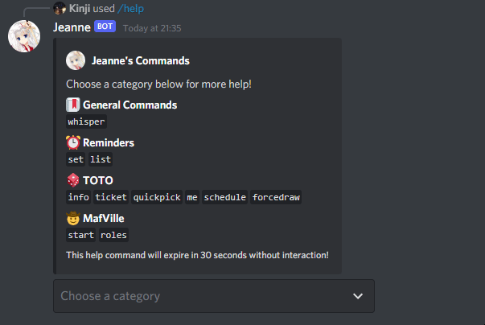
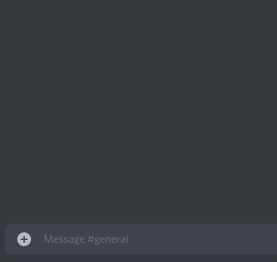

# Jeanne

Jeanne is a Discord bot based on the [Discord.js](https://github.com/discordjs/discord.js/) library.

All of Jeanne's functionalities use Slash Commands (Discord application commands) that were introduced in Discord.js v13.

## Features

- Reminder commands to set reminders, list reminders and delete reminders.

- TOTO commands for users to organise their own TOTO lottery draws. (Based on the [TOTO lottery](<https://en.wikipedia.org/wiki/Toto_(lottery)>))

- MafVille commands for users to play a game of MafVille, a custom version of the [Mafia](<https://en.wikipedia.org/wiki/Mafia_(party_game)>) party game, drawing inspiration from [Town of Salem](https://en.wikipedia.org/wiki/Town_of_Salem).

- Help command `/help` which returns an embed with command information and category menu.

  

- Whisper command `/whisper` which allows users to send a private message to another user within a Discord channel.

  

## Permissions

The following permissions are required for all of Jeanne's commands to work:

- View Channels, Send Messages, Embed Links, Use External Emojis, Use External Stickers, Read Message History
  - For basic bot functionality.
- Manage Channels, Manage Roles
  - For Jeanne to create/delete MafVille channels and change user permission overwrites for those channels.
